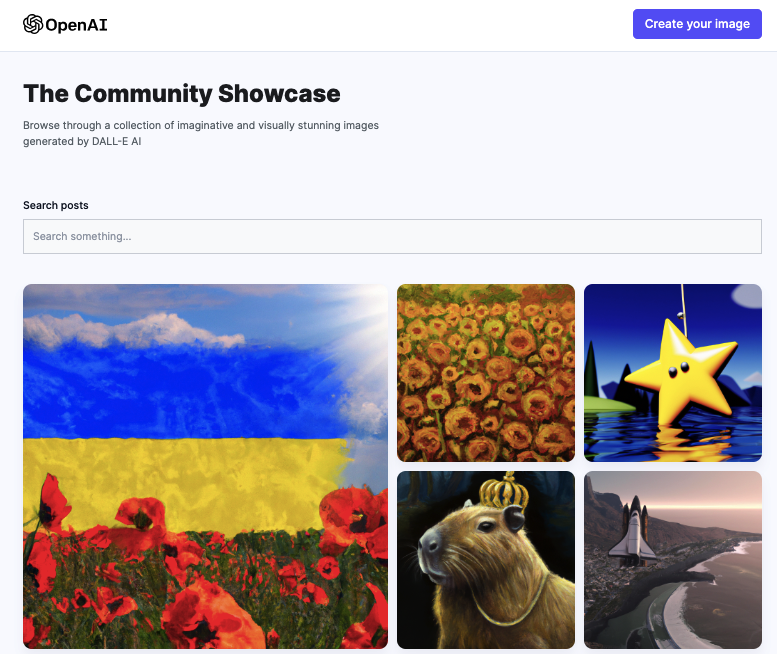

# Full Stack MERN AI Image Generation App
Demo application for generating any images using [OpenAIApi](https://platform.openai.com/docs/guides/images/introduction). App consists of two pages. On page "Create post", you can enter any request to generate an image, or click the buttom `Surprise me` for a random request. If the image is satisfactory, you can share it. Page "Home" displays all generated and shared images. Each image is downloadable. There is also a keyword search.

<span>

</span>

### Project built using:
 - [React](https://react.org/)
 - [Node.js](https://nodejs.org/en)
 - [Express](https://expressjs.com/) - Fast, unopinionated, minimalist web framework for Node.js. 
 - [Mongoose](https://mongoosejs.com/) - MongoDB object modeling for Node.js.
 - Deploy Frontend on [Vercel](https://vercel.com) and Backend on [Cyclic](https://www.cyclic.sh/)
 - [Tailwindcss](https://tailwindcss.com/) - A utility-first CSS framework

 ## Getting Started
1. Clone this repository:

```bash
git clone https://github.com/Tinkkid/ai-image-generation-dall-e-clone
```

2. Install all dependencies:

```bash
npm install
```
3. Setup the necessary environment variables in the .env file. You need use variables for mongoDb, openAi key and for Cloudinary.

4. Changed host in client/Home and client/Posts from `https://doubtful-cardigan-bull.cyclic.app/` to `http://localhost:8080/`
5. Start project (FrontEnd): in terminal choose directory ./client and write command

```bash
npm run dev
```
6. Start project (BackEnd): in terminal choose directory ./server and write command

```bash
npm run dev
```

7. Open [http://localhost:5173](http://localhost:5173) with your browser to see the result for Frontend.

## Live page
Open page - use link [AI-IMAGE_GENERATION](https://ai-image-generation-dall-e-clone-yfq6.vercel.app/)